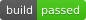

# 🌐 Aditya's Portfolio

Welcome to my personal portfolio! Here you can explore my projects, skills, and achievements. This portfolio showcases my growth and passion for software development and engineering. It’s built with the latest web technologies to give you a modern and responsive experience.

### 🚀 Features
- Modern and responsive UI built with **Tailwind CSS**.
- Interactive and sleek animations using **Vite** and **TypeScript**.
- Project details and links to live demos.

### ⚙️ Technologies Used
- **HTML5** & **CSS3**
- **Tailwind CSS**
- **TypeScript**
- **Vite**
- **GitHub** for version control
- **Vercel** for deployment

### 📥 Cloning the Repository
To clone and run this project locally, follow these steps:

1. **Clone the repository**:
   ```bash
   git clone https://github.com/EchoSingh/portfolio.git
   ```
2. Navigate to the project folder:
   ```bash
   cd portfolio
   ```
3. Install dependencies:
   ```bash
   npm install
   ```
4. Run the project locally:
   ```bash
   npm run dev
   ```
This will start the development server, and you can view the portfolio in your browser.

### 📄 License
This project is licensed under the MIT License - see the [LICENSE](./LICENSE) file for details.

---

Thank you for visiting my portfolio! 🚀
